# Social Signal Demand Forecasting (SSDF): A Mathematical Model for Real-Time Market Heat

## Abstract

In the modern digital entertainment and gaming landscape, standard metrics such as static user reviews, total sales, and trailing monthly active users (MAUs) fail to capture the real-time ebb and flow of audience interest. The **Social Signal Demand Forecasting (SSDF)** model introduces a dynamic, composite framework designed to measure "market heat" in real-time. By analyzing synchronous behaviors across streaming and social platforms, SSDF synthesizes audience volume, engagement quality, retention depth, and directional sentiment into a unified Demand Score ($D$). This white paper details the mathematical underpinnings and theoretical framework of the SSDF engine, alongside its integration with internal workforce telemetry to create a powerful predictive analytics suite.

- Page 1 -

## Table of Contents
1. [Introduction](#1-introduction)
2. [The Core Variables](#2-the-core-variables)
   - [2.1 Concurrent Metrics](#21-ct-concurrent-metrics-volume)
   - [2.2 Stickiness](#22-s-stickiness-retention)
   - [2.3 Capture Score](#23-cs-capture-score-conversion-intensity)
   - [2.4 Attention Score](#24-as-attention-score-retention-depth)
   - [2.5 Social Sentiment Metric](#25-ssm-social-sentiment-metric-directional-polarity)
   - [2.6 Demand Score](#26-d-demand-score-the-composite-output)
   - [2.7 Internal Demand Variables](#27-internal-demand-variables-workforce-telemetry)
3. [Systems Architecture and Variable Interaction](#3-systems-architecture-and-variable-interaction)
   - [3.1 Synthesis Paradigm](#31-synthesis-paradigm)
4. [Data Ingress Schema and Metric Mapping](#4-data-ingress-schema-and-metric-mapping)
   - [4.1 Core Ingress Fields](#41-core-ingress-fields)
   - [4.2 Schema to Variable Mapping](#42-schema-to-variable-mapping)
   - [4.3 Numerical Example: Applying the Equations](#43-numerical-example-applying-the-equations)
5. [Analytic Use Cases in Telemetry Forecasting](#5-analytic-use-cases-in-telemetry-forecasting)
   - [5.1 Predictive Workforce Scheduling](#51-predictive-workforce-scheduling-via-lagged-demand-correlation)
   - [5.2 Toxicity-Driven Productivity Analysis](#52-toxicity-driven-productivity-deterioration-analysis)
   - [5.3 Automated Capacity Breach Detection](#53-automated-capacity-breach-anomaly-detection)
   - [5.4 Stickiness Decay Profiling](#54-post-launch-stickiness-decay-profiling)
   - [5.5 The "Redline" Stress Test](#55-the-redline-stress-test-value-at-risk-simulation)
6. [Conclusion](#6-conclusion)

- Page 2 -

## 1. Introduction

The SSDF engine acts as a real-time telemetry system for audience demand. Rather than relying on lagging indicators, it captures the synchronous velocity and volume of platform interactions (e.g., Twitch, YouTube, Discord) to produce actionable insights predicting future demand trajectories.

The core philosophy of the engine is that **Quantity is not equal to Demand**. A million viewers sitting idle is a weaker demand signal than a hundred thousand viewers actively chatting, subscribing, and sharing, while generating high latency on support endpoints. Therefore, the SSDF engine separates metrics into three distinct categories:

1. **Quantity** (The Volume)
2. **Quality** (The Action and Retention)
3. **Direction** (The Sentiment/Trajectory)

---

## 2. The Core Variables

The SSDF model is built upon seven foundational variables. Six of these calculate external market heat, while the seventh domain tracks the corresponding internal workforce reaction.

### 2.1. $C(t)$: Concurrent Metrics (Volume)
- **Definition:** The raw number of concurrent viewers or users actively engaged on the selected platform at time $t$.
- **Significance:** This serves as the "base volume" of the demand signal. It is the absolute reach of the title at a specific moment in time.

### 2.2. $S$: Stickiness (Retention)
- **Definition:** The ratio of the Peak Metric Count ($V_{peak}$) to the Total Estimated Viewers/Unique Audience ($V_{total}$).
- **Calculation:** $S = \frac{V_{peak}}{V_{total}}$
- **Significance:** $S$ measures how effectively a game retains its audience. A higher Stickiness score indicates that a larger percentage of the audience remains engaged simultaneously, denoting strong retention rather than transient browsing.

### 2.3. $CS$: Capture Score (Conversion Intensity)
- **Definition:** A quantitative measure of the interactions or "signals" generated relative to the audience sample size.
- **Significance:** The Capture Score evaluates the "loudness" or activity level of the audience. A high $CS$ implies the audience is transcending passive observation into active participation (e.g., chatting, tipping, sharing).

### 2.4. $AS$: Attention Score (Retention Depth)
- **Definition:** A percentage score representing the depth of viewer attention, mathematically penalized by audience volatility.
- **Significance:** A high Attention Score indicates a stable, highly focused audience. If the overall audience size is exhibiting high volatility (wild, frequent swings in concurrency), the $AS$ drops. This filters out bot-driven spikes or transient raids, isolating genuine, prolonged interest.

### 2.5. $SSM$: Social Sentiment Metric (Directional Polarity)
- **Definition:** A continuous metric evaluating the velocity (rate of change) and direction of the concurrent user base.
- **Significance:**
  - **Positive $SSM$:** Indicates audience expansion and rapid growth (hyped, bullish sentiment).
  - **Negative $SSM$:** Indicates an audience bleed and rapid decay (cooling, bearish sentiment).

### 2.6. $D$: Demand Score (The Composite Output)
- **Definition:** The final composite output of the SSDF engine representing the current, exact "market heat" of the asset.
- **Calculation (Conceptual):** $D = f(\text{Reach}, \text{Action}, \text{Desire})$
- **Significance:** The Demand Score synthesizes $C(t)$ (Quantity), $S$/$CS$/$AS$ (Quality), and $SSM$ (Direction) into a singular, comparable index.

### 2.7. Internal Demand Variables (Workforce Telemetry)
- **Definition:** Quantifiable metrics representing the operational strain on internal support and workforce systems in response to external market conditions.
  - **Incident Demand (`Pkgs`):** The raw volume of incoming support tickets, logs, or system incidents during the polling window.
  - **Resource Demand (Minutes):** The estimated or actual time-cost in minutes required by the workforce to resolve the Incident Demand.
  - **Productivity Rate (Pkgs/Min):** The mathematical division of Incident Demand by Resource Demand, denoting the efficiency of the active workforce.
- **Significance:** While variables 2.1 through 2.6 measure external market heat, internal variables map the direct physical and financial impact of that heat onto the organization's infrastructure.

- Page 3 -

## 3. Systems Architecture and Variable Interaction

The relationship between these variables formulates the final composite score and its integration against Operational Reality. The flow of data moves from raw external ingress metrics down to internal support resolution.

**Figure 3.1: Systems Architecture and Variable Interaction**

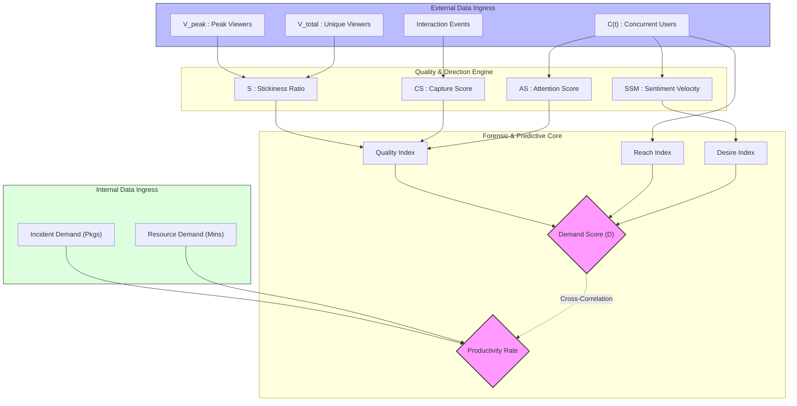

### 3.1 Synthesis Paradigm

1. **Quantity:** $C(t)$ establishes the absolute ceiling of potential impact.
2. **Quality:** $S$ (Holding the room), $CS$ (Engaging the room), and $AS$ (Focusing the room) act as multipliers against the base volume. $10,000$ viewers with high $CS$ and $AS$ generate a vastly higher Demand Score than $50,000$ viewers with minimal engagement.
3. **Direction:** $SSM$ dictates the trajectory. A massive audience bleeding heavily (Negative $SSM$) results in a decaying Demand Score, predicting a downward trend before standard metrics detect it.

- Page 4 -

## 4. Data Ingress Schema and Metric Mapping

The engine ingests raw payload telemetry representing highly granular synchronous states. It operates on a **universal, normalized schema structure** (`raw_{source}_{year}.jsonl`). Ingress processors normalize data from distinct platforms (e.g., YouTube Live, Discord, Kick) to match this exact schema format.

### 4.1. Core Ingress Fields

#### 4.1.1. `id`
A unique alphanumeric identifier assigned to the specific live streaming session. Ensures graceful processing of multiple distinct broadcasts from the same creator.
#### 4.1.2. `user_id` / `user_login`
A permanent, unique identifier for the broadcasting channel or creator used to track long-term stickiness.
#### 4.1.3. `game_id` / `game_name`
The permanent numeric identifier and string title of the target asset being analyzed (e.g., `League of Legends`). Acts as the primary grouping key.
#### 4.1.4. `title`
The custom metadata string chosen by the creator describing their current broadcast session.
#### 4.1.5. `tags`
An array of categorical strings (e.g., `["Esports", "Drops"]`). Relevant for predictive filtering and assigning engagement weights ($E_i$).
#### 4.1.6. `is_mature`
A boolean flag (`true` or `false`) indicating age-restricted content. Acts as an engagement modifier.
#### 4.1.7. `viewer_count`
The instantaneous numerical measurement of an individual stream's concurrent viewers at the exact moment of the API snapshot. Summing this across grouped sessions provides $C(t)$.
#### 4.1.8. `started_at`
The UTC timestamp of stream initiation. Vital for calculating total viewer burn-rates and audience churn.
#### 4.1.9. `timestamp`
The exact UTC epoch interval logging when the payload was successfully scraped. Acts as the independent time variable ($t$).

### 4.2. Schema to Variable Mapping

- **$C(t)$ (Metrics / Concurrent Users):**
  $$C(t) = \sum_{i=1}^{n} v_i(t)$$
- **$S$ (Stickiness):**
  $$S = \frac{\max_{t \in W} C(t)}{V_{total}}$$
- **$CS$ (Capture Score):**
  $$CS(t) = \frac{\alpha \frac{d}{dt}N(t) + \sum_{i=1}^{n} (E_i \cdot v_i(t))}{C(t)}$$
- **$AS$ (Attention Score):**
  $$AS(t) = 1 - \left( \lambda \frac{\sigma_C}{\mu_C} + \gamma \max_i \left( \frac{v_i(t)}{C(t)} \right) \right)$$
- **$SSM$ (Sentiment / Velocity):**
  $$SSM(t) = \text{sgn}\left( \frac{C(t) - C(t - \Delta t)}{\Delta t} \right)$$
- **$D$ (Demand Score):**
  $$D(t) = \lfloor \log_{10}(V_{peak}) \cdot (CS(t) \cdot AS(t)) \cdot SSM(t) \cdot K \rfloor$$

### 4.3. Numerical Example: Applying the Equations

**Hypothetical Telemetry Ingress**
**Table 4.1: Hypothetical Telemetry Ingress (Snapshot $t_0$)**

| `game_id` | `id` | `viewer_count` | `tags` | `is_mature` | 
| :--- | :--- | :--- | :--- | :--- | 
| `1001` | `s_901` | 50,000 | `["Esports", "Drops"]` | `false` | 
| `1001` | `s_902` | 10,000 | `["Playthrough"]` | `true` | 

**Table 4.2: Hypothetical Telemetry Ingress (Snapshot $t_1$, 10 minutes later)**

| `game_id` | `id` | `viewer_count` | `tags` | `is_mature` | 
| :--- | :--- | :--- | :--- | :--- | 
| `1001` | `s_901` | 52,000 | `["Esports", "Drops"]` | `false` | 
| `1001` | `s_902` | 9,000 | `["Playthrough"]` | `true` |
| `1001` | `s_904` | 3,000 | `["First Play"]` | `false` | 

**Calculations for Game 1001 at $t_1$:**
1. **$C(t_1)$:** $52,000 + 9,000 + 3,000 = 64,000 \text{ viewers}$
2. **Stickiness ($S$):** Assume $V_{total} = 120,000$ over the window. $S = \frac{64,000}{120,000} = 0.53$
3. **Capture Score ($CS$):** Using weights (`Drops=0.5, Playthrough=1.0, First Play=1.5`) and $\alpha = 500$:
   $CS = \frac{500(1) + [(0.5 \times 52k) + (1.0 \times 9k) + (1.5 \times 3k)]}{64,000} = \frac{500 + 39,500}{64,000} = 0.625$
4. **Sentiment ($SSM$):** Comparing $t_1$ (64,000) to $t_0$ (60,000). Velocity is positive. $SSM = +1$
5. **Demand Score ($D$):** Assuming $AS = 0.82$, $K = 100$:
   $D = \lfloor \log_{10}(64,000) \times (0.625 \times 0.82) \times (+1) \times 100 \rfloor = \lfloor 4.806 \times 0.5125 \times 100 \rfloor = 246$

- Page 5 -

## 5. Analytic Use Cases in Telemetry Forecasting

The true value of the SSDF architecture lies in its ability to fuse External Variables (Demand, Attention, Sentiment) with Internal Workforce Variables (Resource Demand, Productivity). This synthesis unlocks forensic, predictive, and operational capabilities across gaming, marketing, and workforce management.

### 5.1. Predictive Workforce Scheduling via Lagged Demand Correlation

**Concept:** External social velocity rarely impacts internal support queues instantaneously. A sudden spike in *Demand (D)* combined with plunging *Sentiment (SSM)* (e.g., a server crash during a massive tournament) will generate a wave of support tickets on a delay. By calculating the exact time-lag between external peaks and internal surges, Workforce Management (WFM) teams can dynamically adjust schedules prior to queue collapse.

**Methodology:** Use a Cross-Correlation Function (CCF) on the time series to identify the exact minute-lag (`t+k`) that yields the highest correlation coefficient between `SSM` drop and `Incident Demand` spike.

**Numeric Example & Assumptions:** 
At 14:00, $D$ spikes from 150 to $D=800$, while $SSM$ drops to $-1.0$. WFM knows from historical CCF modeling that $Lag = 45$ minutes. At exactly 14:45, *Incident Demand* spikes from $3,000 \rightarrow 12,000$ tickets. WFM successfully shifted 50 agents off breaks at 14:30.

**Table 5.1: Lagged Correlation Example (Demand vs Incidents)**

| Time | Demand Score (D) | Scaled Incidents |
| :--- | :--- | :--- |
| 13:45 | 150 | 10 |
| 14:00 | 800 | 15 |
| 14:15 | 750 | 20 |
| 14:30 | 600 | 30 |
| 14:45 | 400 | 950 |
| 15:00 | 200 | 800 |
*(Bar overlay represents scaled Incident Ticket Volume delayed by exactly 45 minutes)*

**Figure 5.1a: WFM Alert Module Action Flow**

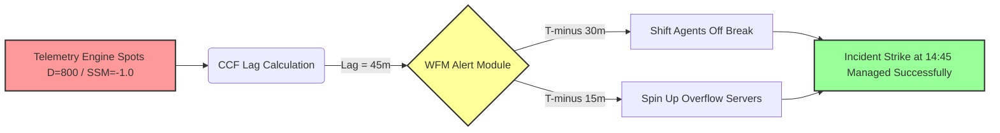

 
 

**Figure 5.1b: Lag Correlation Timeline Mechanism**

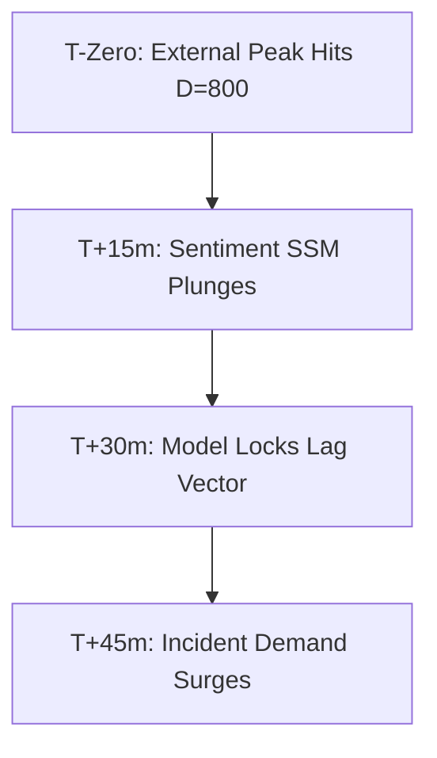

**Reference:** *Gans, N., Koole, G., & Mandelbaum, A. (2003). "Telephone Call Centers: Tutorial, Review, and Research Prospects." Manufacturing & Service Operations Management.* 

- Page 6 -

### 5.2. "Toxicity-Driven" Productivity Deterioration Analysis

**Concept:** During highly negative viral events, players submit angrier, more complex tickets. This analyzes historical data to prove that specific external social states directly degrade internal *Productivity Rates*. This enables objective operational adjustments rather than attributing low output to agent inefficiency.

**Methodology:** Employ Decision Tree Classifiers to find the exact external threshold (e.g., `SSM < -0.4` and `D > 500`) that mathematically guarantees a structural drop in `Productivity Rate` below the local rolling average.

**Numeric Example & Assumptions:** 
A normal shift runs at a `Productivity Rate` of $0.65$ Pkgs/Min. During a poorly received patch ($SSM = -1.0, D > 600$), tickets become abusive. Agents require more time to de-escalate. Resolving $1,000$ incidents usually requires $1,538$ Resource Minutes. During the toxic event, resolving those same $1,000$ incidents requires $2,857$ Resource Minutes, plunging `Productivity` to $0.35$ Pkgs/Min.

**Table 5.2: Toxicity vs. Productivity Yield Classification**

| Event | Volume | Sentiment | Classification Phase |
| :--- | :--- | :--- | :--- |
| Quiet Weekend | Low | High | Low Priority (Q3) |
| Esports Finals | High | High | Golden Launch (Q2) |
| Patch 1.2 Delay | High | Low | Toxicity Zone (Q4) |
| Server Crash | High | Low | Toxicity Zone (Q4) |

**Figure 5.2a: Toxicity Decision Tree and KPI Adjustment**

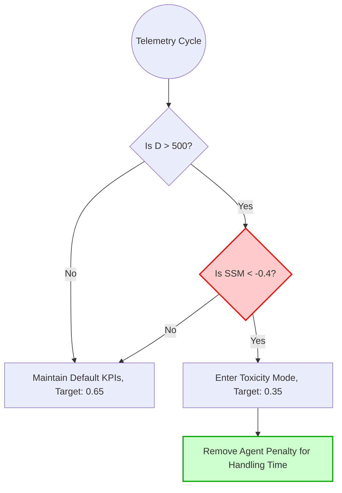

 
 

**Figure 5.2b: Forensic Impact Breakdown**

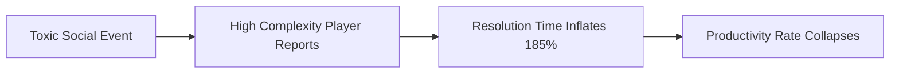

**Reference:** *Grandey, A. A. (2003). "When 'The Show Must Go On': Surface Acting and Deep Acting as Determinants of Emotional Exhaustion." Academy of Management Journal.*

- Page 7 -

### 5.3. Automated Capacity Breach Anomaly Detection

**Concept:** Internal Demand usually tracks linearly with External Demand. If *Incident Demand* violently spikes but *External Volume* remains flat, it indicates a highly localized internal failure (e.g., a silent payment gateway bug) that hasn't hit social media yet.

**Methodology:** Train an unsupervised anomaly detection model (e.g., Isolation Forests) on `(Demand D, Incident Demand)` coordinate pairs. Flag instances that fall outside the 95% confidence cluster as "Uncoupled Anomalies".

**Numeric Example & Assumptions:** 
- **Type A Anomaly:** $D = 120$ (Low). `Incident Demand` spikes to $15,000$ Pkgs. Conclusion: A critical, non-social bug (billing error) is occurring. Alert Engineering.
- **Type B Anomaly:** $D = 950$ (Extreme). `Incident Demand` remains flat at $2,000$ Pkgs. Conclusion: A famous streamer is generating visual hype without breaking the servers. Do nothing.

**Table 5.3: Tracking Anomaly Variance (Internal vs External)**

| Time | External Demand | Internal Incidents | Note |
| :--- | :--- | :--- | :--- |
| T-1 | 10 | 10 | Baseline |
| T-2 | 12 | 11 | Baseline |
| T-3 | 11 | 10 | Baseline |
| T-4 | 15 | 85 | **Type A (High Internal, Low External)** |
| T-5 | 12 | 12 | Baseline |
| T-6 | 95 | 10 | **Type B (High External, Low Internal)** |
*(Line denotes External Demand, Bar denotes Internal Incident Demand. T-4 and T-6 represent massive anomalous decoupling)*

**Figure 5.3a: Capacity Breach Isolation Forest State Diagram**

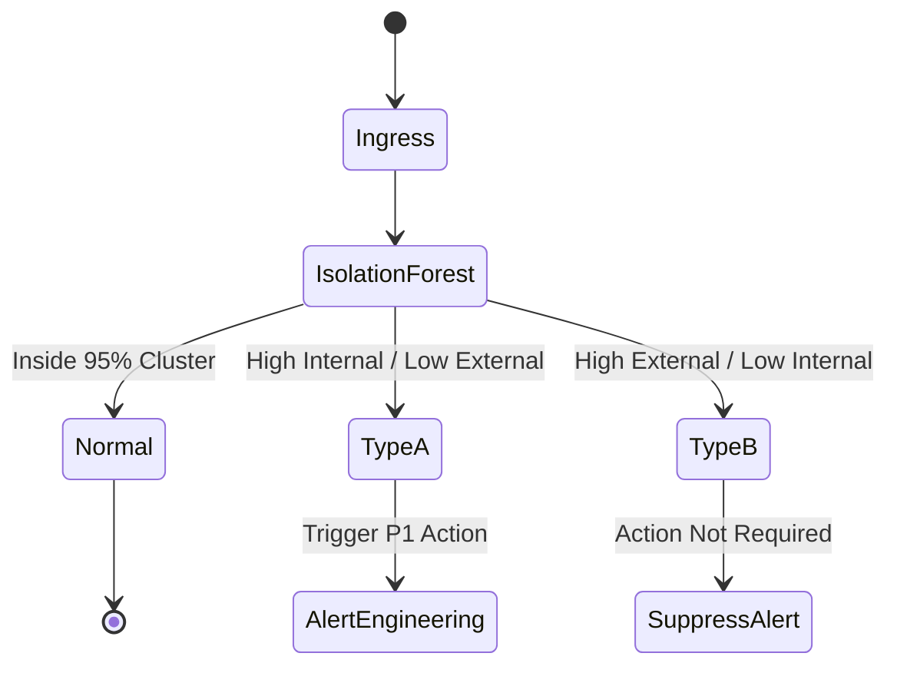

 
 

**Figure 5.3b: Incident Triage Pipeline for Decoupled Anomalies**

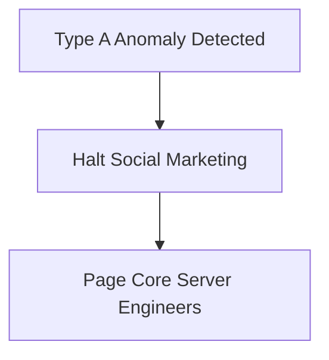

**Reference:** *Chandola, V., Banerjee, A., & Kumar, V. (2009). "Anomaly Detection: A Survey." ACM Computing Surveys.* 

- Page 8 -

### 5.4. Post-Launch "Stickiness" Decay Profiling

**Concept:** Major marketing pushes cause immediate spikes in volume. By forensically analyzing the tail-end of a major spike—specifically the "half-life" of *Stickiness (S)*—studios can objectively grade the long-term retention of the content release, divorced from the initial marketing hype.

**Methodology:** Fit an exponential decay curve ($N(t) = N_0 e^{-\lambda t}$) to the `Stickiness (S)` variable post-peak to calculate the decay constant ($\lambda$). A lower decay constant signifies superior audience retention.

**Numeric Example & Assumptions:** 
- **DLC 1:** Peak Volume $= 300,000$. Stickiness $S = 0.85$. Day 7 Volume is $80,000$, but Stickiness is $S = 0.70$. Decay Constant ($\lambda$) is $0.02$. A massive fundamental success.
- **DLC 2:** Peak Volume $= 500,000$. Stickiness $S = 0.85$. Day 7 Volume is $80,000$. Stickiness $S = 0.20$. Decay Constant ($\lambda$) is $0.24$. A fundamental failure despite higher initial volume.

**Table 5.4: Stickiness (S) Exponential Decay Profile (DLC 1 vs DLC 2)**

| Days Since Launch | DLC 1 (Healthy $\lambda = 0.02$) | DLC 2 (Toxic $\lambda = 0.24$) |
| :--- | :--- | :--- |
| Day 1 | 0.85 | 0.85 |
| Day 2 | 0.82 | 0.50 |
| Day 3 | 0.80 | 0.40 |
| Day 4 | 0.78 | 0.35 |
| Day 5 | 0.75 | 0.30 |
| Day 6 | 0.72 | 0.25 |
| Day 7 | 0.70 | 0.20 |
*(Top Line: DLC 1 (Healthy $\lambda = 0.02$), Bottom Line: DLC 2 (Toxic $\lambda = 0.24$))*

**Figure 5.4a: Retention Grade Decision Tree**

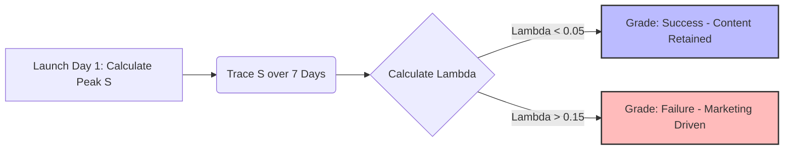

 
 

**Figure 5.4b: Decay Profiling Calculation Pipeline**

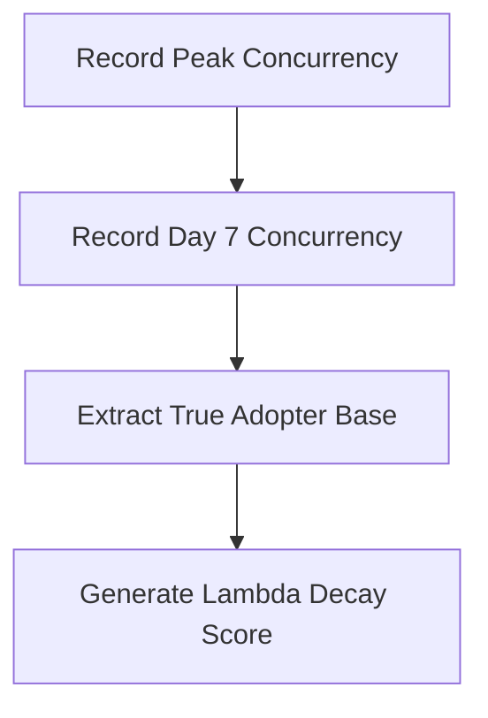

**Reference:** *Sifa, R., Bauckhage, C., & Drachen, A. (2014). "The Playtime Volatility of Free-To-Play Games." IEEE Conference on Computational Intelligence and Games.* 

- Page 9 -

### 5.5. The "Redline" Stress Test (Value-at-Risk Simulation)

**Concept:** Borrowing from financial risk management, this backward-analysis calculates how much External Demand the current internal workforce can absorb before failing. By historically tracking the exact *Demand (D)* level that forced *Resource Demand* to hit maximum capacity, the engine establishes a "System Redline."

**Methodology:** Use Logistic Regression to calculate the Probability Density Function (PDF) of a Queue Failure (e.g., Resource Demand exceeding 95% capacity) given variable $X$ (Demand D).

**Numeric Example & Assumptions:** 
Feeding 6 months of historical data into the simulation, the model calculates a Queue Failure (wait times exceeding 2 hours) is 95% likely whenever $D > 850$ and $SSM < 0$. The studio's "System Redline" is exactly $D=850$. If a newly announced event is forecast to hit $D=1200$, they definitively know they must outsource support capacity.

**Table 5.5: Value-at-Risk Logistic Regression: Probability of Queue Failure**

| Demand Score (D) | Probability of Failure (%) |
| :--- | :--- |
| 100 | 1% |
| 250 | 2% |
| 400 | 5% |
| 550 | 15% |
| 700 | 45% |
| 850 | **95% (Redline)** |
| 1000 | 99% |
*(The S-Curve hits the 95% Redline at precisely D=850)*

**Figure 5.5a: Pre-Emptive Action Outsource Trigger Flow**

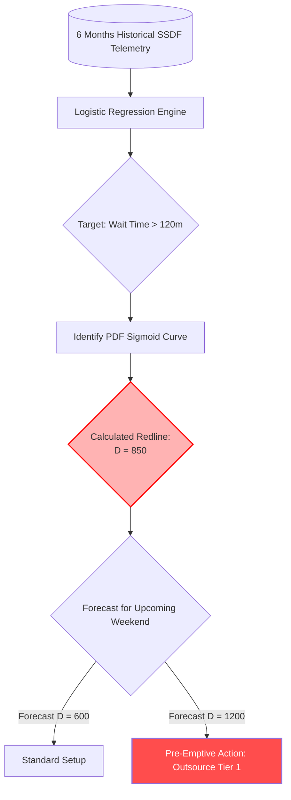

 
 

**Figure 5.5b: Value-at-Risk Calibration Process**

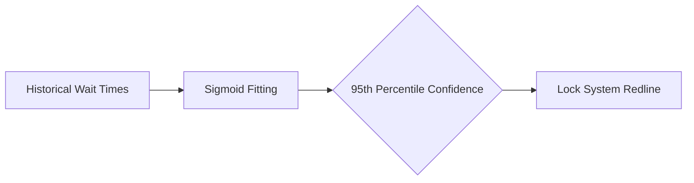

**Reference:** *Jorion, P. (2007). "Value at Risk: The New Benchmark for Managing Financial Risk."*

- Page 10 -

## 6. Conclusion

The Social Signal Demand Forecasting (SSDF) model provides a revolutionary, real-time approach to understanding market heat. By algorithmically separating the raw quantity of viewers from the quality of their engagement, and mapping highly granular external JSON telemetry alongside internal support loads, the SSDF engine delivers a predictive suite that accurately reflects true consumer demand and its resulting operational impact at any given second.

- Page 11 -

