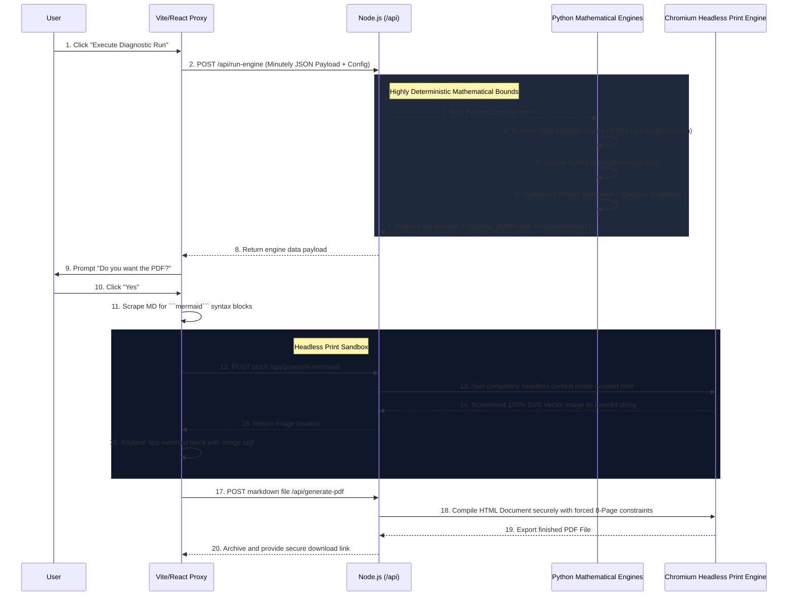

# SSDF Telemetry Engine: Diagnostic Reporting Pipeline

```mermaid
sequenceDiagram
    participant User
    participant ReactUI as Vite/React Proxy
    participant NodeAPI as Node.js (/api)
    participant Python as Python Mathematical Engines
    participant Puppeteer as Chromium Headless Print Engine

    User->>ReactUI: 1. Click "Execute Diagnostic Run"
    ReactUI->>NodeAPI: 2. POST /api/run-engine (Minutely JSON Payload + Config)
    
    rect rgb(30, 41, 59)
    note right of NodeAPI: Highly Deterministic Mathematical Bounds
    NodeAPI-->>Python: 3. Boot Python Script via stdin 
    Python->>Python: 4. Execute Math (Isolation Forest / CCF / Logistic Regression)
    Python->>Python: 5. Render PyPlot to Base64 Image array
    Python->>Python: 6. Synthesize 8-Page Markdown + Diagram Templates
    Python-->>NodeAPI: 7. Output Final payload: { realData, plotBase64, markdownReport }
    end
    
    NodeAPI-->>ReactUI: 8. Return engine data payload
    
    ReactUI->>User: 9. Prompt "Do you want the PDF?"
    User->>ReactUI: 10. Click "Yes"
    
    ReactUI->>ReactUI: 11. Scrape MD for ```mermaid``` syntax blocks
    
    rect rgb(15, 23, 42)
    note left of NodeAPI: Headless Print Sandbox
    ReactUI->>NodeAPI: 12. POST block /api/generate-mermaid
    NodeAPI->>Puppeteer: 13. Spin completely headless context inside isolated html
    Puppeteer-->>NodeAPI: 14. Screenshot 100% SVG Vector image as base64 string
    NodeAPI-->>ReactUI: 15. Return image location
    ReactUI->>ReactUI: 16. Replace text mermaid block with Image tag!
    end

    ReactUI->>NodeAPI: 17. POST markdown file /api/generate-pdf
    NodeAPI->>Puppeteer: 18. Compile HTML Document securely with forced 8-Page constraints
    Puppeteer-->>NodeAPI: 19. Export finished PDF File
    NodeAPI-->>ReactUI: 20. Archive and provide secure download link
```
